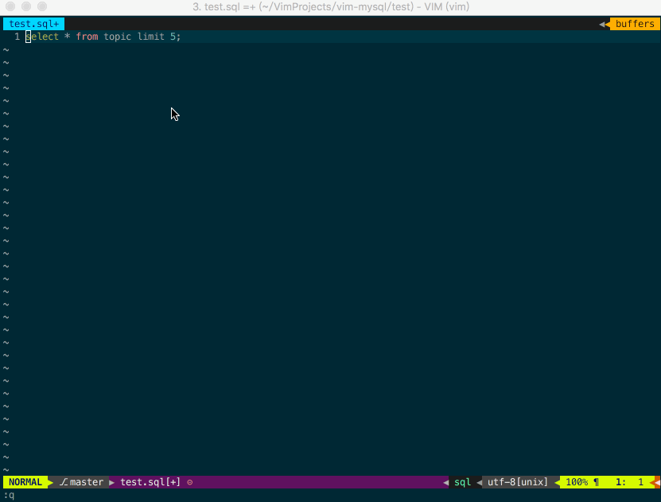

# mysql.vim

原版的脚本是python2的，改成支持python3

mysql.vim 是可以在 Vim 中快速运行 Mysql 命令的插件

<!-- more -->
<!-- toc -->
## 截图

## 安装
需要类 Unix 系统，并且安装 Mysql
### Pathogen
```bash
$ cd ~/.vim/bundle
$ git clone https://github.com/wxnacy/vim-mysql.git
$ cd ~/.vim/bundle/vim-mysql
$ ./install.sh
```

### Vundle
修改 `~/.vimrc`
```bash
Plugin 'wxnacy/vim-mysql'
```
在 Vim 中运行
```bash
:PluginInstall
```
```bash
$ cd ~/.vim/bundle/vim-mysql
$ ./install.sh
```

## 配置
配置密码
```bash
echo 'export MYSQL_LOCAL_USER=your_local_user' >> ~/.bash_profile
echo 'export MYSQL_LOCAL_PASSWORD=your_local_password' >> ~/.bash_profile
echo 'export MYSQL_LOCAL_HOST=your_local_host' >> ~/.bash_profile
echo 'export MYSQL_LOCAL_DB=your_local_db' >> ~/.bash_profile
source ~/.bash_profile
```
这样可以配置 ***local*** 环境的 Mysql 信息，如果需要 ***prod*** 环境
可以继续配置 `MYSQL_PROD_USER, MYSQL_PROD_PASSWORD, MYSQL_PROD_HOST, MYSQL_LOCAL_DB`

## 使用
```bash
<Leader>rs  # 在 normal 模式运行光标所在行的命令
<Leader>rsp # 在 prod 环境中运行 mysql 命令
```
